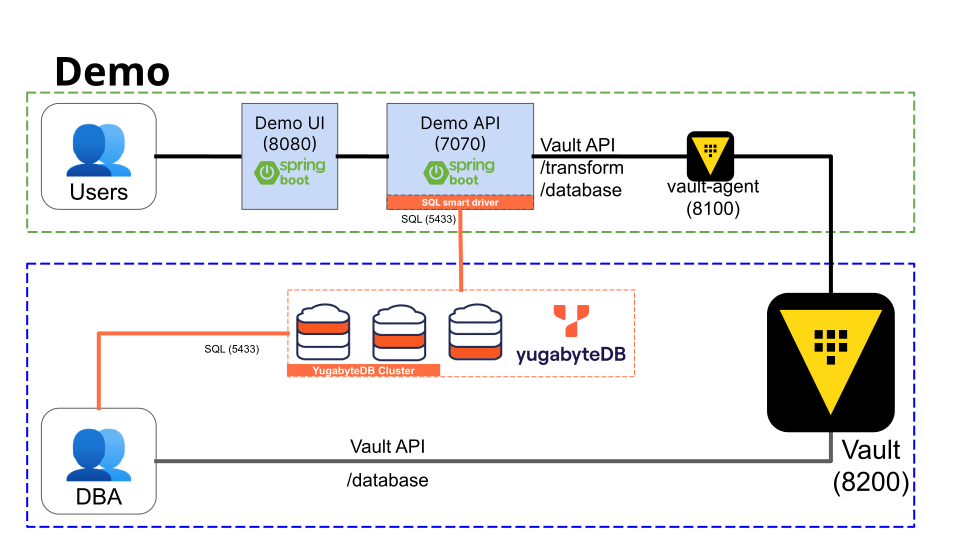
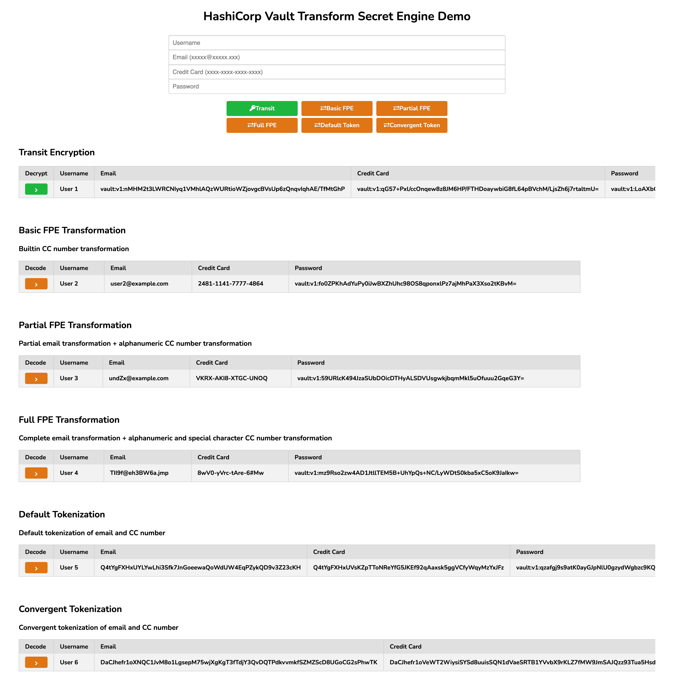

# Vault Transform Secrets Engine with YugabyteDB Demo



- demo-ui is a simple single page application built with Spring Boot
- demo-api is a Spring Boot application that exposes a REST API for the demo-ui.
  - It calls the Vault agent to transform sensitive data and store the transformed data in MySQL
  - It uses the Spring Cloud Vault library to integrate with the Vault API, i.e. to retrieve dynamic database credentials.
- Vault agent act as a sidecar proxy here to retrieve secrets from Vault.
  - Auto-auth is used to handle the login to Vault and the renewal of the Vault auth token. Using auto-auth removes the responsibility of managing the auth token from the client application, making it easier for application to consume Vault’s API.
  - Vault agent is optional in this case since Spring Cloud Vault library has the ability to authenticate to Vault.
- On the Vault server side 3 secrets engines are enabled: database, transform, and transit
  - The database secrets engine integrates with MySQL to generate dynamic DB credentials for the demo-app
  - The transform secrets engine is configured to use MySQL as an external token storage for tokenization

# Prerequisites
- [Docker Desktop](https://www.docker.com/products/docker-desktop/)
- Vault Enterprise License - Contact Hashicorp for a trial license
# Quick Start

```bash
export VAULT_LICENSE="....."
git clone -b yb https://github.com/yogendra/vault-transform-demo.git
cd vault-transform-demo
bin/demo start
```
Access Consoles:
- [Demo UI](http://localhost:8080)
- [Vault](http://localhost:8200)
- [YugabyteDB UI](http://localhost:15433)
- [SQL Console](http://localhost:3000)



# Useful commands
```shell
bin/demo apps-start        - start infra containers
bin/demo add-sample-data   - add sample data
bin/demo help              - this screen
bin/demo dc                - run docker-compose commands
bin/demo infra-start       - start infra containers
bin/demo sample-data-clear - clear sample data
bin/demo sample-data-show  - show sample data
bin/demo sample-data-add   - add sample data
bin/demo start             - start infra and apps
bin/demo stop              - stop demo containers
bin/demo watch             - look are container logs
bin/demo ysqlsh            - start the YSQLSH shell
```

# Reference
- [YugabyteDB Documentation](https://docs.yugabyte.com)
- [Vault Transform Demo](https://github.com/tkaburagi/vault-transformation-demo/tree/master)
- [Vault Transform Tutorial](https://developer.hashicorp.com/vault/tutorials/adp/transform)
- [Vault Tokenization Tutorial](https://developer.hashicorp.com/vault/tutorials/adp/tokenization)
- [Vault Transform Secrets Engine API](https://developer.hashicorp.com/vault/api-docs/secret/transform#transform-secrets-engine-api)
- [Vault Demo by Nicholas Jackson](https://github.com/nicholasjackson/demo-vault)
- [Spring Cloud Vault](https://cloud.spring.io/spring-cloud-vault/reference/html/#_quick_start)
